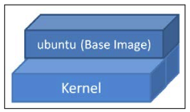

---


### Docker Bootcamp

<span style="color:gray">Less is more with Docker</span><br/>
<span style="color:gray">by Russ McKendrik</span>

---

# 2

#### Lauching Applications Using Docker
* Using Docker on the command-line to launch applications
* How to use the Docker `build` command
* Using Docker compose to make multi-container applications easier to launch

---

#### Docker Terminology

Before we start learning how to launch containers, we should quickly discuss some of the more common terminology we are going to be using in this chapter.

---

#### Docker Images

A Docker image is a collection of all the  files that make up an executable software application.

* This collection includes the application plus all the libraries, binaries, and other dependencies.

* These  files in the Docker image are read-only and hence the content of the image cannot be altered.

+++

Docker image is made up of layers which you can review using `docker image history` subcommand.
```shell
$ docker images
REPOSITORY               TAG     IMAGE ID      CREATED      SIZE
ubuntu                   16.04   ccc7a11d65b1  4 days ago   120MB
capstonedemoapp_railsvm  latest  c19dd0c1f846  3 weeks ago  1.64GB
:

$ docker image history ubuntu
IMAGE         CREATED       CREATED BY                                     
ebcd9d4fca80  3 months ago  /bin/sh -c #(nop)  CMD ["/bin/bash"]          
<missing>     3 months ago  /bin/sh -c mkdir -p /run/systemd && echo '...
<missing>     3 months ago  /bin/sh -c sed -i 's/^#\s*\(deb.*universe\...
<missing>     3 months ago  /bin/sh -c rm -rf /var/lib/apt/lists/*
<missing>     3 months ago  /bin/sh -c set -xe   && echo '#!/bin/sh' >...
<missing>     3 months ago  /bin/sh -c #(nop) ADD file:d14b493577228a4...
```

+++

The Docker images have a parent/child relationship and the bottom-most image is called the `base image`.
The base image is the special image that doesn't have any parent.



+++

Each addition that is made to the original base image is stored in a separate layer.


---

#### Docker Registry

A `Docker Registry` is a place where Docker images can be stored in order to be publicly or privately found, accessed, and used by worldwide software developers.

+++

Using the `docker image push` subcommand, you can dispatch your Docker image to the registry so that it is registered and deposited. Using the `docker image pull` subcommand, you can download a Docker image from the registry.

+++

A Docker Registry could be hosted by a third party as a public or private registry, such as:
* [Docker Hub](https://hub.docker.com/)
* [Quay](https://quay.io/)
* [Google Container Registry](https://cloud.google.com/container- registry/)
* [AWS Container Registry](https://aws.amazon.com/ecr/)

---

#### Docker Hub

The Docker Hub is the official repository that contains all the curated images that are created by the worldwide Docker community.

It is publicly available at, `index.docker.io`.

+++

You can download any third-party image by using the `docker image pull` subcommand, as shown here:
```shell
$ docker image pull russmckendrick/cluster
```

+++

A manual repository path is similar to a URL without a protocol specifier, such as `https://`, `http://` and `ftp://`.

Following is an example of pulling an image from a third-party repository:
```shell
docker image pull registry.domain.com/myapp
```

---

#### Some Related Links

[Homepage](https://www.packtpub.com/virtualization-and-cloud/docker-bootcamp)
